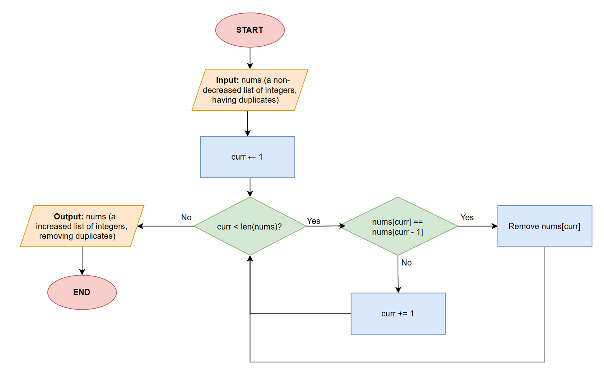
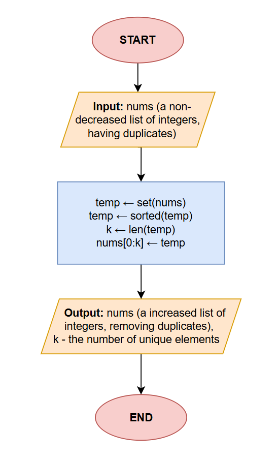
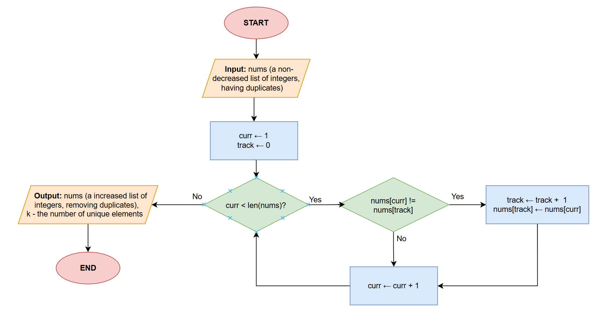

# Remove Duplicates from Sorted List
> The problem link is here: [Remove Duplicates from Sorted List - Leetcode](https://leetcode.com/problems/remove-duplicates-from-sorted-array/description/?envType=study-plan-v2&envId=top-interview-150)
## Description
You are given an integer array ``nums`` sorted in non-decreasing order. Your task is to remove duplicates from ``nums`` in-place so that each element apears only once. 

After removing the duplicates, return the number of unique elements, denoted as ``k``, such that the first ``k`` elements of ``nums`` contain the unique elements.

**Example**
```python
Input: nums = [1,1,2,3,4]

Output: [1,2,3,4,_]
```
## Approach 1: Remove elements 
### 1. Intuition
We iterate every elements of the list. If the current element is equal to the previous one, we remove it. This approach is simple but increase time complexity because every time we remove the duplicates, we need to rearrange the remaining element. Therefore the ```pop()``` function takes ``n`` complexity, resulting to the large time complexity of this solution - $O(n)$.
### 2. Algorithm

### 3. Code
```python
class Solution:
    def removeDuplicates(self, nums: List[int]) -> int:
        curr = 1
        while curr < len(nums):
            if nums[curr] == nums[curr - 1]:
                nums.pop(curr)
            else:
                curr += 1
        return len(nums)
```
### 4. Time & Space Complexity
- Time complexity: $O(n^2)$
- Space complexity: $O(1)$ extra space.

# Approach 2: Sorted Set $^1$
### 1. Intuition
A set automatically removes duplicates, and a sorted set maintains order. We insert all elements into sorted set, then copy the unique elements back to the original array. This approach is simple but uses extra space and doesn't take advantage of the array already being sorted.
### 2. Algorithm

### 3. Code
```python
class Solution:
    def removeDuplicates(self, nums: list[int]) -> int:
        unique = sorted(set(nums))
        nums[:len(unique)] = unique
        return len(unique)
```
### 4. Time & Space Complexity
- Time complexity: $O(nlogn)$.
- Space complexity: $O(n)$.


## Approach 3:  Two pointers
### 1. Intuition
This approach resembles to the first approach, but instead of removing the element directly in the list, we will replace value whose the position that has duplicate value into the next unique value.
### 2. Algorithm

### 3. Code
```python
from typing import List

class Solution:
    def removeDuplicates(self, nums: List[int]) -> int:
        track = 0
        curr = 1
        while curr < len(nums):
            if nums[curr] != nums[track]:
                track += 1
                nums[track] = nums[curr]
                curr += 1
            else:
                curr += 1
        return track + 1
```
### 4. Time & Space Complexity
- Time complexity: $O(n)$
- Space complexity: $O(1)$ extra space.
---
**Reference:**
-  (1) [Remove Duplicates From Sorted Array - NeetCode](https://neetcode.io/solutions/remove-duplicates-from-sorted-array)