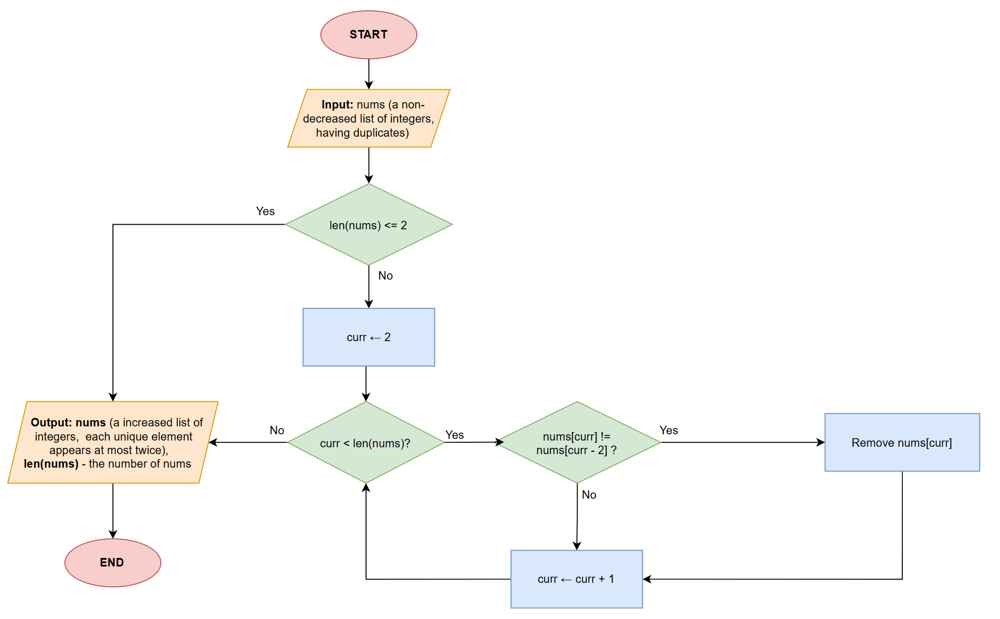
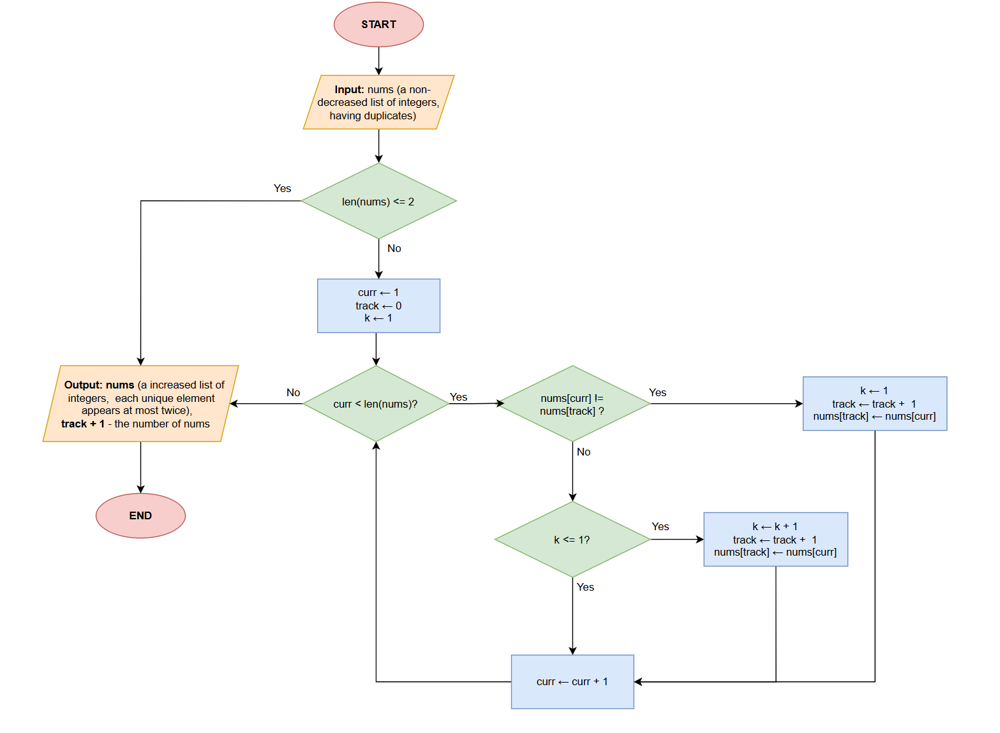
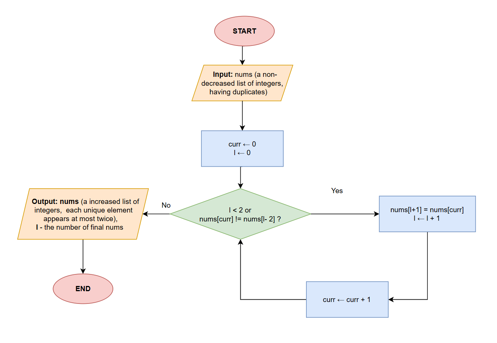

# Remove Duplicates from Sorted List II
> The problem link is here: [Remove Duplicates from Sorted List II - Leetcode](https://leetcode.com/problems/remove-duplicates-from-sorted-array-ii/?envType=study-plan-v2&envId=top-interview-150)
## Description
Given an integer array nums sorted in non-decreasing order, remove some duplicates in-place such that each unique element appears at most twice. The relative order of the elements should be kept the same.

Since it is impossible to change the length of the array in some languages, you must instead have the result be placed in the first part of the array nums. More formally, if there are ```k``` elements after removing the duplicates, then the first ```k``` elements of nums should hold the final result. It does not matter what you leave beyond the first ``k`` elements.

**Example**
```python
Input: nums = [0,0,1,1,1,1,2,3,3]

Output: [0,0,1,1,2,3,3,_,_]
```

## Approach: Brute Force 
### 1. Intuition
We iterate every elements of the list. If the current element appear at most twice, we remove it. This approach is simple but increase time complexity because every time we remove the duplicates, we need to rearrange the remaining element.
### 2. Algorithm

### 3. Time & Space Complexity
- Time complexity: $O(n^2)$
- Space complexity: $O(1)$ extra space.
## Approach 1: Hash Map $^1$
### 1. Intuition
We iterate every elements of the list. If the current element appear at most twice, we remove it. This approach is simple but increase time complexity because every time we remove the duplicates, we need to rearrange the remaining element.
### 2. Algorithm
1. Count occurrences of each element while tracking their first appearance order.
2. Iterate through unique elements in order.
3. For each element, write it to the result position once, then write it again if it appeared more than once.
4. Return the final write position as the new length.
### 3. Code
```python
class Solution:
    def removeDuplicates(self, nums: List[int]) -> int:
        if len(nums) <= 2:
            return len(nums)
        counter = Counter(nums)
        i = 0
        for num in counter:
            nums[i] = num
            counter[num] -= 1
            i += 1
            if counter[num] >= 1:
                nums[i] = num
                i += 1
        return i   
```
### 4. Time & Space Complexity
- Time complexity: $O(n)$
- Space complexity: $O(n)$ extra space.

# Approach 2: Two Pointers
### 1. Intuition
We process groups of consecutive duplicates together. For each group, we write at most two copies to the result portion of the array. The left pointer tracks where to write, and the right pointer scans through the array finding groups.
### 2. Algorithm

### 3. Code
```python
class Solution:
    def removeDuplicates(self, nums: List[int]) -> int:
        k = 1
        track = 0
        for curr in range(1, len(nums)):
            if nums[curr] != nums[track]:
                k = 1
                nums[track + 1] = nums[curr]
                track += 1
            elif k <= 1:
                k += 1
                nums[track + 1] = nums[curr]
                track += 1
        return track + 1
```
### 4. Time & Space Complexity
- Time complexity: $O(n)$.
- Space complexity: $O(1)$.


## Approach 3:  Two pointers (Optimal)  $^1$
### 1. Intuition
The cleanest approach uses a single condition: we only write an element if the write position is less than 2 (first two elements always go through) OR the current element differs from the element two positions back in the result. This automatically limits each value to at most two occurrences.
### 2. Algorithm

### 3. Code
```python
from typing import List

class Solution:
    def removeDuplicates(self, nums: List[int]) -> int:
        l = 0
        for r in range(len(nums)):
            if l < 2 or nums[r] != nums[l-2]:
                nums[l] = nums[r]
                l += 1
        return l
```
### 4. Time & Space Complexity
- Time complexity: $O(n)$
- Space complexity: $O(1)$ extra space.
---
**Reference:**
-  (1) [Remove Duplicates From Sorted Array II - NeetCode](https://neetcode.io/solutions/remove-duplicates-from-sorted-array-ii)